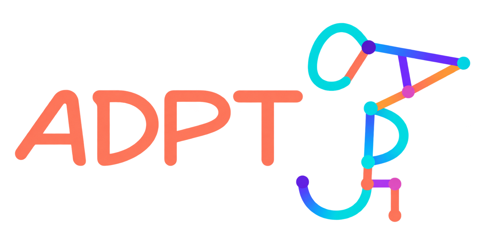
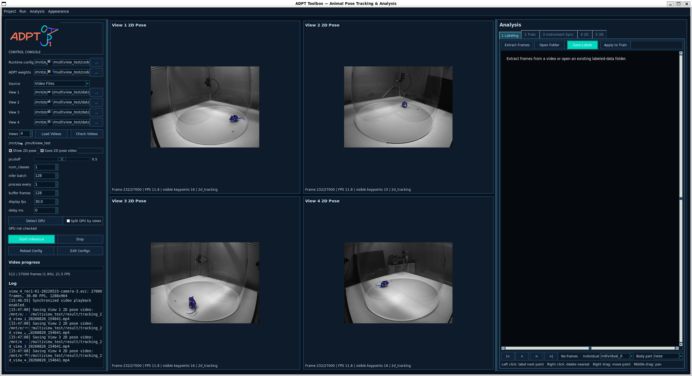
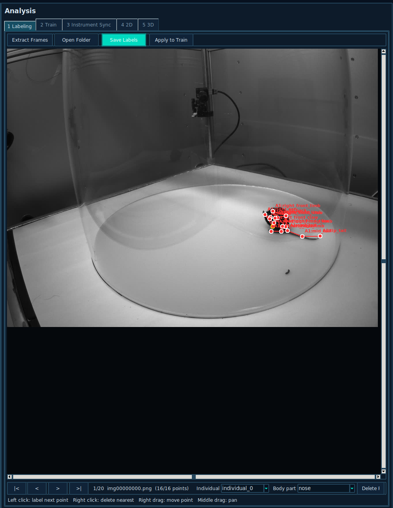
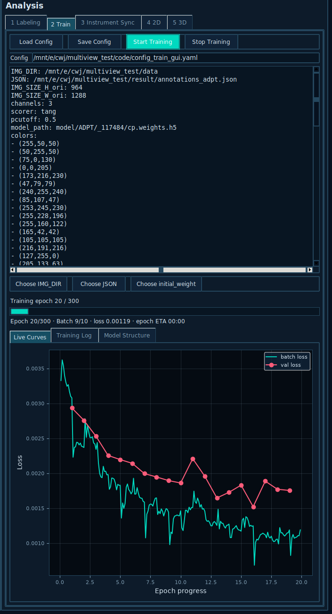
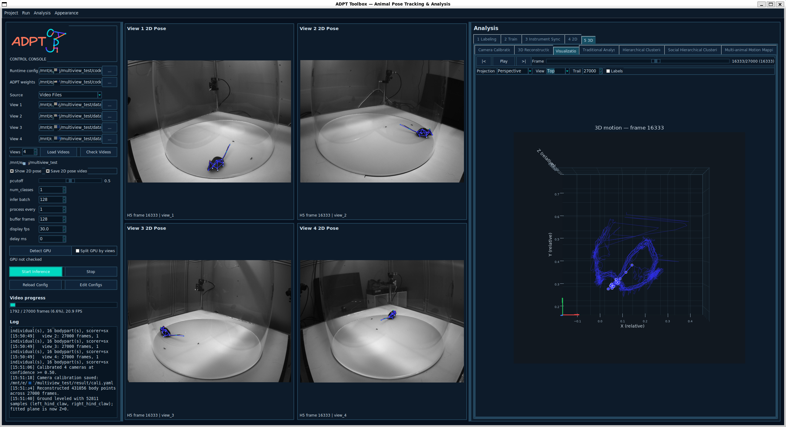

# ADPT Toolbox

<p align="center"></p>

<p align="center"><strong>Animal pose tracking, synchronized multi-view acquisition, 2D/3D reconstruction, and behavioral analysis in one research GUI.</strong></p>

<p align="center">
  <a href="https://www.python.org/"></a>
  <a href="https://www.tensorflow.org/"></a>
  <a href="release/RESEARCH_LICENSE.txt"></a>
  <a href="https://doi.org/10.7554/eLife.95709"></a>
</p>

ADPT Toolbox is a project-based desktop application for animal pose experiments. It links video acquisition, body-point annotation, ADPT model training, real-time or offline multi-view inference, quantitative 2D analysis, camera calibration, 3D reconstruction, synchronized visualization, and exploratory behavior mapping.

ADPT（Anti-Drift Pose Tracker）工具箱是一套面向动物姿态与行为研究的桌面软件。一个项目内即可完成视频采集、数据标注、模型训练、多视角二维追踪、相机标定、三维重建、传统运动学分析和批量无监督行为分析。

> ADPT Toolbox is research software under active development. Tracking accuracy, camera geometry, timing precision, physical-unit calibration, and statistical conclusions must be validated for each experimental setup.

## Workflow

```text
Acquire / import videos
          ↓
Extract and label representative frames
          ↓
Train and validate an ADPT model
          ↓
Run live or offline multi-view 2D tracking
          ↓
Inspect trajectories, confidence, speed, and spatial statistics
          ↓
Calibrate cameras and reconstruct synchronized 3D motion
          ↓
Visualize, export, and run batch behavior analysis
```

Each experiment lives in a self-contained project with its runtime, configuration, data, models, results, and metadata. Video files selected for inference are referenced in place rather than duplicated into the project.

## Interface

### Multi-view inference

Process one to four synchronized videos or camera streams, control buffering and display independently, optionally save annotated video, and write multi-view tracking results to H5.

<p align="center"></p>

### Integrated annotation

Extract frames, label multiple animals and body points, zoom and pan, and merge annotations from every labeled-data folder into one training dataset.

<p align="center"></p>

- Left click: label the current point.
- Right drag: move an existing point.
- Right click: delete the nearest point.
- Middle drag: pan the image.

Moving to another image or clearing a frame resets the labeling sequence to the first body point.

### Training monitor

Edit the training YAML, choose images, annotations, and initial weights, then monitor batch loss, validation loss, epoch progress, ETA, logs, and model structure without blocking the GUI.

<p align="center"></p>

### Synchronized 2D/3D visualization

Select calibrated views, triangulate high-confidence observations, level the ground plane, inspect the 3D skeleton, and keep the source 2D frames synchronized while scrubbing or playing the timeline.

<p align="center"></p>

## Main capabilities

### Project management

- Create and open self-contained ADPT projects.
- Launch from any directory with `python -m adpt_gui`.
- Keep experiment configuration, annotation, runtime, model, and results together.
- Resize Control, live-view, and Analysis panels like ordinary desktop windows.
- Switch between science and terminal-inspired themes.

### Acquisition and synchronization

- Use USB/OpenCV cameras, Intel RealSense cameras, or video files.
- Configure one to four views and supported camera resolution/FPS modes.
- Record synchronized videos without loading the inference model.
- Limit recording by seconds or frame count.
- Pair concurrent RealSense streams using hardware timestamps.
- Connect electrophysiology, two-photon, Open Ephys, ScanImage, NI-DAQ, LabJack, LSL, UDP JSON, or custom instrument adapters.

Software event timestamps use `time.perf_counter_ns`. Sub-millisecond experiments should implement real TTL/digital triggering and record the external instrument clock.

### ADPT inference

- Run real-time camera inference or batch inference on synchronized videos.
- Use one or two GPUs and optionally assign view groups to separate GPUs.
- Configure inference batch, processing interval, buffer, display FPS, and delay.
- Hide live 2D pose panels for a pure-inference layout.
- Save annotated videos independently of live display.
- Export a combined DeepLabCut-compatible multi-view H5 result.

### 2D analysis

- Select view, individual, and body point.
- Plot coordinates, confidence, trajectory, speed, acceleration, cumulative distance, occupancy, and distance from the activity center.
- Apply confidence filtering and temporal smoothing.
- Synchronize the analysis cursor with video.
- Export one complete CSV per view.
- Calibrate an ROI of known size to convert pixels, distance, speed, plots, tables, and CSV into `um`, `mm`, `cm`, `m`, or `in`.

A planar pixel calibration is only valid near the calibrated image plane. It does not establish metric scale for arbitrary-depth 3D motion.

### Camera calibration and 3D reconstruction

- Load synchronized 2D tracking H5 results and select a view subset.
- Use body-point correspondences above a configurable confidence threshold (`0.75` by default).
- Triangulate from at least two views and confidence-weight additional observations.
- Fit ground-contact points, rotate the plane to horizontal, and set it to `Z = 0`.
- Undo ground leveling and export the complete 3D trajectory.
- Rotate, zoom, pan, scrub, and play a Mokka-style synchronized 3D scene.

Body-point correspondence calibration produces a relative coordinate system. Metric 3D requires a known-distance scale, a target with known dimensions, or reliable depth measurements.

### Traditional 3D analysis

For a selected animal and body point, display X/Y/Z coordinates, height, 3D speed, acceleration, cumulative path length, speed distribution, top/side trajectories, XY occupancy, distance from the activity center, and numerical summaries.

### Batch behavior mapping

The exploratory pages accept multiple reconstructed 3D CSV files. Samples enter a shared embedding space while dataset, frame, and animal identity remain available in the export.

- **Hierarchical Clustering**: Behavior Atlas-inspired single-animal posture, velocity, and locomotion analysis.
- **Social Hierarchical Clustering**: SBeA-inspired dyadic analysis with inter-animal position, distance, and approach/retreat dynamics.
- **Multi-animal Motion Mapping**: M3-inspired analysis where every animal/frame is an independent sample in a shared UMAP space and animals are clustered together within each recording.

UMAP and HDBSCAN are used when installed; PCA and K-means provide a deterministic fallback. Exports include a sample-level embedding CSV and per-dataset/per-animal `_occupancy.csv` summary.

> These are independent, paper-inspired ADPT modules. They are not official implementations of, affiliated with, or endorsed by the referenced packages. The social page does not reproduce SBeA's pose/identity networks, DTAK/ResMLP mapper, or watershed detector. Use original packages for exact reproduction.

## Installation

### Supported release targets

- CPython 3.12, Windows x86-64 or Linux/WSL x86-64.
- Recommended: Windows 11 + WSL2 Ubuntu 24.04, or recent native Linux.
- NVIDIA GPU recommended; Intel RealSense support is optional.

Binary bundles are platform- and ABI-specific. Linux `.so` files cannot run on Windows, and Windows `.pyd` files cannot run inside WSL.

### Create an environment

Ubuntu/WSL:

```bash
sudo apt update
sudo apt install -y python3.12-venv python3-pip graphviz libgl1 libglib2.0-0
python3.12 -m venv ~/venvs/adpt
source ~/venvs/adpt/bin/activate
python -m pip install --upgrade pip setuptools wheel
```

Windows PowerShell:

```powershell
py -3.12 -m venv $env:USERPROFILE\venvs\adpt
& $env:USERPROFILE\venvs\adpt\Scripts\Activate.ps1
python -m pip install --upgrade pip setuptools wheel
```

Install a TensorFlow build compatible with the GPU first, then from the unpacked release directory:

```bash
pip install -r requirements_gui.txt
pip install -e . --no-deps
```

### NVIDIA GPUs

Always verify the installed runtime:

```bash
nvidia-smi
python -c "import tensorflow as tf; print(tf.__version__); print(tf.config.list_physical_devices('GPU'))"
```

RTX 5090/Blackwell has compute capability `sm_120`. Use a trusted TensorFlow/Keras build with CUDA 12.8-or-newer Blackwell support and matching cuDNN 9. A wheel that only detects the GPU can still fail with `CUDA_ERROR_INVALID_PTX`, `CUDA_ERROR_INVALID_HANDLE`, or `No DNN in stream executor`.

```bash
python verify_blackwell.py
```

Continue only when GPU detection, kernel, and Conv2D tests succeed.

### NumPy compatibility

The research environment pins `numpy==1.26.4` because the augmentation stack depends on aliases removed in NumPy 2.x. Do not independently upgrade NumPy, SciPy, scikit-image, or tifffile without retesting annotation, augmentation, training, and inference.

## Launch

```bash
python -m adpt_gui
```

Open a project explicitly:

```bash
python -m adpt_gui --project /path/to/my_adpt_project
adpt-gui --project /path/to/my_adpt_project
```

## First experiment

1. Select **Project → New Project** and choose an empty target folder.
2. Choose view count and source type in Control.
3. Record videos or load synchronized files.
4. Open **Analysis → Labeling**, extract representative frames, and label all points.
5. Save labels and click **Apply to Train**.
6. Open **Train**, verify paths/settings, and start training.
7. Load the resulting `*.weights.h5` and run inference.
8. Open **2D** to inspect confidence, trajectories, kinematics, spatial statistics, and physical calibration.
9. For multi-view data, open **3D**, calibrate, reconstruct, level, and visualize.
10. Export multiple reconstructions and load them together for batch behavior mapping.

## Project and output structure

```text
my_adpt_project/
├── code/                         project runtime, configs, assets, launcher
├── data/                         recordings and labeled-data folders
├── model/                        checkpoints when configured
├── result/                       H5, CSV, calibration, figures, sync logs
└── project.yaml                  project metadata
```

Tracking H5 hierarchy:

```text
/view_1 ... /view_4
scorer → individual → bodypart → x / y / likelihood
```

Per-view 2D CSV:

```text
frame,time_s,individual,bodypart,x,y,confidence,valid,speed
```

Reconstructed 3D CSV:

```text
frame,individual,bodypart,x,y,z,confidence
```

Batch embedding CSV:

```text
dataset,frame,animal,module,embedding_1,embedding_2[,embedding_3]
```

## Troubleshooting

### TensorFlow does not use the GPU

Check `nvidia-smi`, TensorFlow visibility, CUDA/cuDNN compatibility, and wheel compute capabilities. GPU memory allocation alone does not prove valid accelerated execution.

### `np.sctypes`, `np.long`, or `np.uint_` errors

```bash
pip install --force-reinstall numpy==1.26.4 scipy==1.14.1 scikit-image==0.24.0 tifffile==2024.9.20
```

### Windows paths in WSL

Windows `E:\...` corresponds to `/mnt/e/...` in WSL. Normalize embedded backslashes and prefer project-relative paths.

### Model weight shape mismatch

Checkpoint and configuration must use the same input dimensions, body-point order, skeleton, animal/class count, and output channels. Keep the training YAML with its checkpoint.

### Two GPUs are slower than one

Distribution overhead can dominate small or input-limited workloads. Compare equal effective batch sizes, profile input, and use view-level GPU separation for independent multi-view inference.

## Research Edition

The Research Edition compiles the GUI runtime, training backend, and prediction backend into CPython 3.12 native extensions and removes their protected Python sources from the staged distribution. Project creation preserves the protected runtime for its platform.

- [Build and release guide](release/README.md)
- [Clean-room test checklist](release/CLEAN_ROOM_TEST_ZH.md)
- [Third-party notices](release/THIRD_PARTY_NOTICES.md)

## Citation

If ADPT contributes to your research, cite:

> Tang, G., Han, Y., Sun, X., Zhang, R., Han, M.-H., Liu, Q., & Wei, P. (2025). **Anti-drift pose tracker (ADPT), a transformer-based network for robust animal pose estimation cross-species.** *eLife*. https://doi.org/10.7554/eLife.95709

```bibtex
@article{tang2025adpt,
  title   = {Anti-drift pose tracker (ADPT), a transformer-based network for robust animal pose estimation cross-species},
  author  = {Tang, Guoling and Han, Yaning and Sun, Xing and Zhang, Ruonan and Han, Ming-Hu and Liu, Quanying and Wei, Pengfei},
  journal = {eLife},
  year    = {2025},
  doi     = {10.7554/eLife.95709}
}
```

When corresponding paper-inspired behavior modules materially contribute, also cite the relevant original methods:

- Huang, K., Han, Y., Chen, K., et al. (2021). **A hierarchical 3D-motion learning framework for animal spontaneous behavior mapping.** *Nature Communications*, 12, 2784. https://doi.org/10.1038/s41467-021-22970-y
- Han, Y., Chen, K., Wang, Y., et al. (2024). **Multi-animal 3D social pose estimation, identification and behaviour embedding with a few-shot learning framework.** *Nature Machine Intelligence*, 6, 48–61. https://doi.org/10.1038/s42256-023-00776-5
- McInnes, L., Healy, J., & Melville, J. (2018). **UMAP: Uniform Manifold Approximation and Projection for Dimension Reduction.** arXiv:1802.03426. https://doi.org/10.48550/arXiv.1802.03426
- McInnes, L., Healy, J., & Astels, S. (2017). **hdbscan: Hierarchical density based clustering.** *Journal of Open Source Software*, 2(11), 205. https://doi.org/10.21105/joss.00205

Original ADPT repository: https://github.com/tangguoling/ADPT

## License

ADPT Toolbox Research Edition 2.0 is distributed under the [ADPT Toolbox Research Edition License](release/RESEARCH_LICENSE.txt) for non-commercial research, teaching, and academic evaluation subject to its terms. Protected engine source code is not included in binary releases.

Previously published GPL-3.0 versions remain under the licenses that accompanied them. Contact the ADPT copyright holders for commercial use or broader redistribution rights.

## Acknowledgements

ADPT Toolbox builds on TensorFlow/Keras, OpenCV, NumPy, pandas, Matplotlib, UMAP, HDBSCAN, DeepLabCut-compatible conventions, and optional Intel RealSense support. We thank the researchers and open-source contributors who make reproducible animal behavior analysis possible.
